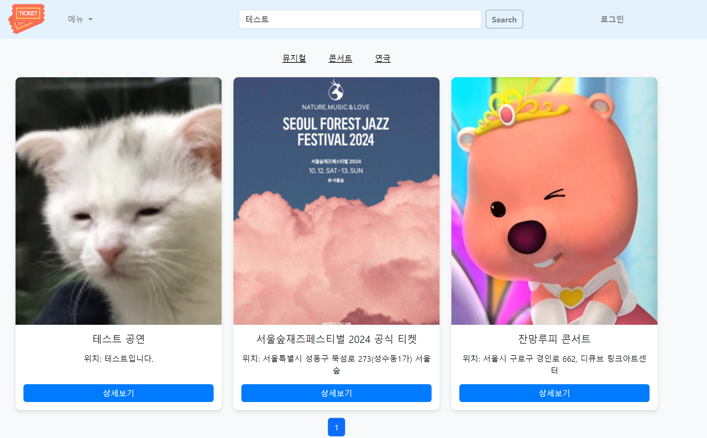

# 🖥️ No Pain No Code 조의 Give_me_the_ticket 프로젝트

## 프로젝트 소개

- 서비스명: Give_me_the_ticket
- 프로젝트 한 줄 설명: 공연 예매와 예매한 티켓의 중고 거래를 한 곳에서 지원하는 서비스
- 서비스 기획 의도:
  - 일반적인 중고 거래 티켓은 암표 형태로 진행됨
  - 그래서 가격의 상한선이 존재하지 않고 사기 당할 위험도 사용자가 부담해야 함
  - 하지만 이 서비스를 통해 티켓을 예매한 곳에서 중고 거래 함으로써 안전하고 알맞은 가격에 거래가 가능하게 지원할 수 있음
- 서비스 배포 URL : https://mymycode.shop/views
- 팀 노션 URL :
  [No Pain No Code](https://www.notion.so/No-Pain-No-Code-2ce80522fefd4216bae9986af368b6b3?pvs=21)
- GitHub : [Give_me_the_ticket](https://github.com/jkc-mycode/Give_me_the_ticket)

<br>

## 팀원 구성 및 역할 분배

- 팀장 : 안지윤 [@komiharuu](https://github.com/komiharuu)
  - 공연 티켓 구매, 환불 구현
  - 공연 찜하기, 취소 구현
  - 발표 PPT 제작
- 부팀장 : 김정찬 [@jkc-mycode](https://github.com/jkc-mycode)
  - 회원가입, 로그인/로그아웃, 토큰 재발급 구현
  - 카카오 소셜 로그인 구현
  - AWS S3를 이용한 이미지 업로드 구현
  - 초기 세팅 및 CI/CD 설정
  - 서비스 배포
- 팀원 : 이윤형 [@clearghost3](https://github.com/clearghost3)
  - 중고 거래 게시물 CRUD 구현
  - 중고 티켓 구매 로직 구현
  - 시연 영상 제작
- 팀원 : 이수빈 [@soobeen0301](https://github.com/soobeen0301)
  - 공연 CRUD 구현
  - Elasticsearch를 이용한 공연 검색 기능 구현
  - README 작성
- 팀원 : 방채은 [@xszvvfm](https://github.com/xszvvfm)
  - 사용자 정보 조회, 수정, 회원 탈퇴 구현
  - portone을 이용한 사용자 포인트 충전 기능 구현
  - 프로젝트 MVP 발표
    <br>

## 1. MVP 개발 기간

- 2024.07.22 ~ 2024.08.08 (총 18일)

<br>

## 2. 개발 환경

- 운영체제 : Window/Mac

  - Front-End : HTML, CSS, JavaScript, EJS
  - Back-End : TypeScript, Node.js, Nest.js
  - DataBase : MySQL, TypeORM, AWS RDS
  - Deploy : Gibhub Actions, AWS EC2, ALB, ACM

  

<br>

## 3. 프로젝트 이용

## Installation

```bash
$ npm install
```

## Running the app

```bash
# development
$ npm run start

# watch mode
$ npm run start:dev

# production mode
$ npm run start:prod
```

## Test

- swagger : http://localhost:3000/

<br>

## 4. 기획 관련

- 일정 계획 (간트차트) : https://docs.google.com/spreadsheets/d/1_2s0liNMu8FX_m3TipS1r_ZdDQyDjgLJToEeR5Tb-Mo/edit?gid=446658082#gid=446658082

- API 명세서 : https://www.notion.so/teamsparta/a3adab1478264779b4be45c417490229?v=271c930fb8ac4db8a5c3e5662bb39287

- ERD : https://www.erdcloud.com/d/pgD4S7yRJLJ2nfFBg

- 와이어프레임 : https://www.figma.com/file/FhXzCnzAKXrQAvpXVqRdNV?embed_host=notion&kind=file&node-id=0-1&t=5SS3F7d713NJ63yQ-1&viewer=1

- 전체, 핵심 로직 흐름도 : https://miro.com/app/board/uXjVKw91G9Q=/
  

<br>

## 5. 주요 기능 및 설명

### 5-1. 사용자 포인트 충전 API

#### 5-1-1. /src/modules/users/users.service.ts

- 포인트를 충전하고, 로그를 기록합니다.

- https://github.com/jkc-mycode/Give_me_the_ticket/blob/3fa41ab72531a177aff08c53434bf55cb5dcffd1/src/modules/users/users.service.ts#L277-L319

#### 5-1-2. /src/modules/payments/payments.service.ts

- 포트원을 이용해 결제 결과를 검증하고 포인트 충전 금액을 DB에 저장합니다.

- https://github.com/jkc-mycode/Give_me_the_ticket/blob/3fa41ab72531a177aff08c53434bf55cb5dcffd1/src/modules/payments/payments.service.ts#L50-L105

- 포인트 충전 흐름도
  

- 내 정보 페이지 -> MY POINT 탭 -> 포인트 충전 버튼 클릭합니다.

  

- 이동한 포인트 충전 페이지에서 충전할 포인트 금액 입력 후 결제하기 버튼 클릭합니다.
  

- 사용자가 원하는 결제 방법 선택 가능합니다.
  

- 결제 완료 시 결제 성공 창이 뜨며 내정보 페이지로 이동합니다.
  

- 변동된 포인트 금액과 내역을 확인 가능합니다.
  
  <br>

### 5-2. 공연 목록 조회 및 검색 API

#### 5-2-1. /src/modules/shows/search/search.service.ts

- updatedAt을 기준으로 5분 단위로 스케줄링하며 수정된 데이터만 인덱싱합니다.

- https://github.com/jkc-mycode/Give_me_the_ticket/blob/3fa41ab72531a177aff08c53434bf55cb5dcffd1/src/modules/shows/search/search.service.ts#L127-L148

- Elasticsearch를 이용해 오타를 보정하여 유사 검색을 합니다.

- https://github.com/jkc-mycode/Give_me_the_ticket/blob/3fa41ab72531a177aff08c53434bf55cb5dcffd1/src/modules/shows/search/search.service.ts#L155-L180

#### 5-2-2. /src/modules/shows/shows.service.ts

- 목록 조회 시 인덱싱한 데이터를 가져와 반환합니다.

- https://github.com/jkc-mycode/Give_me_the_ticket/blob/3fa41ab72531a177aff08c53434bf55cb5dcffd1/src/modules/shows/shows.service.ts#L132-L143

- 오타 검색 결과 : '시하고'라고 오타로 검색했을 경우 원하는 결과인 '시카고'를 조회할 수 있습니다.
  

<br>

### 5-3. 공연 티켓 환불 API

#### 5-3-1. /src/modules/shows/shows.service.ts

- 공연 티켓 환불 시 정책을 기반으로 에러 처리를 합니다.
- 환불된 금액을 사용자 포인트에 입금하고, 해당 공연의 잔여 좌석을 증가시킵니다.

- https://github.com/jkc-mycode/Give_me_the_ticket/blob/3fa41ab72531a177aff08c53434bf55cb5dcffd1/src/modules/shows/shows.service.ts#L517-L612

- 공연 티켓 환불 흐름도
  

- 공연 티켓 환불 페이지
- 내 정보 페이지 -> MY TICKET -> 환불을 원하는 티켓의 환불 버튼을 클릭합니다.
  

  - 티켓 환불 페이지로 이동되며, Refund 버튼을 클릭합니다.
    

  - 환불이 완료되었다는 창이 뜨며, 티켓 내역 조회 시 티켓의 상태가 변경된 것을 확인 가능합니다.
    
    
    <br>

<br>

### 5-4. 중고 거래 티켓 구매 API

#### 5-4-1. /src/modules/trades/trades.service.ts

- 사용자가 중고 티켓을 구매 시 티켓을 구매자의 티켓으로 재발급합니다.
  (판매자의 티켓은 로그만 남고 사용하지 못하는 티켓이 되도록)

- 중고 거래 게시물의 상태를 변경한 뒤 목록에서 조회되지 않도록 삭제합니다.

- https://github.com/jkc-mycode/Give_me_the_ticket/blob/3fa41ab72531a177aff08c53434bf55cb5dcffd1/src/modules/trades/trades.service.ts#L389-L437

- 중고 거래 티켓 구매 흐름도
  

- 중고 거래 페이지
- 중고 거래 목록 조회 페이지에서 중고 거래 게시물을 확인할 수 있습니다.
  

- 원하는 중고거래 게시글을 클릭하여 중고 거래 구매 버튼을 클릭합니다.
  

- 거래에 성공했다는 창이 뜨며, 내 정보 조회 -> MY TICKET 확인 시 구매한 티켓이 있는 것을 확인 할 수 있습니다.
  
  
  <br>

## 6. 트러블슈팅

### 6-1. bull 사용

- **문제** : bull을 사용한 동시성 처리 테스트에서 특정 좌석에 대해 중복 점유 및 실패해도 201 성공이 발생하는 문제 발생

- **추정 원인** : 특정 자원을 큐에서 하나씩 꺼내 결제를 진행하는 과정에서 자원에 대한 락이 없었음

- **시도한 내용** : bull을 지우고 bull의 업그레이드 버전인 bullmq를 설치

- **해결 방안** : bull queue도 사용이 가능하지만, 구매 로직에서는 큐보다 락이 더 적합하다고 판단되어 TypeORM에서 제공하는 비관적 락을 사용하여 티켓 구매 로직의 동시성 처리를 구현

<br>

### 6-2. Elasticsearch 이용

#### 6-2-1. 데이터 휘발

- **문제** : 공연 목록 조회 시 전달 data안에 이미지 URL을 함께 전달하고 있지만 새로고침을 연달아 클릭 시 data안에 이미지URL이 휘발되는 문제 발생


- **추정 원인**

  - 내가 기대한 내용 : 기존의 인덱싱된 인덱스는 그대로 두고, 변동이 있는 인덱스만 인덱싱

  - 실제 동작하는 내용 : 기존 인덱스를 모두 삭제하고 다시 모든 데이터를 인덱싱
    → 실제 인덱스는 15개 밖에 없는데, 새로고침 할 떄 마다 Elasticsearch안에 삭제된 문서가 증가함

  - 결과 : 기존 데이터를 비우고 다시 인덱싱하는 과정보다 실제 새로고침하는 시간이 더 짧아 JOIN이 있는 이미지 URL을 가져오는게 늦어져 data안에 이미지 URL이 휘발되는 것으로 추정

- **시도한 내용**

  - 짧은 스케줄링 간격과 deletedAt컬럼 때문에 기존 데이터도 지워버리고 다시 인덱싱하는 듯해 수정

  - 기존 코드 : 1분마다 deletedAt컬럼을 기준으로 컬럼 값이 있다면 인덱스를 삭제하고, 값이 null이라면 인덱스를 생성 하도록 구현

  - 수정한 코드 : 5분마다 updatedAt컬럼을 기준으로 스케줄링을 돌며 현재 시간의 5분 전과 비교하여 변경된 데이터만 인덱싱하도록 구현

- **해결 방안**
  - Elasticsearch(search.service.ts) : 인덱싱한 id만 반환
  - 공연 목록 조회 API (shows.service.ts) : 인덱싱한 id에 해당하는 데이터를 DB에서 조회하여 데이터 반환
  - 최종 해결 방법 : 기존에 연결한 AWS OpenSearch 도메인을 삭제하고, 새로운 도메인을 생성하여 연결하였더니 기존에 작성한 코드로도 데이터가 휘발되지 않고 정상 작동함
    <br>

#### 6-2-2. 유사 검색

- **문제** : 유사 검색을 위해 match쿼리에 fuzziness를 설정하여 검색 시 너무 많은 정보가 검색됨

- **추정 원인** : 유사도가 낮은 문서도 검색을 해서 데이터를 반환해주는 것 같음

- **시도한 내용** : fuzzy query실행, mult_match쿼리 설정 등 해당 방법은 오타 보정이 되지 않음

- **해결 방안** : "minmum_shold_match" : "55%"로 유사도를 조절하여 해결

- 유사 검색 해결 전 (minimum_should_match 옵션 설정 전)
- '테스트공연' 검색을 위해 '테스트'를 검색 시 '스'와 '트'가 포함된 다른 공연도 조회됩니다.
  

- 유사 검색 해결 후 (minimum_should_match : 55% 설정 후)
- '테스트공연' 검색을 위해 '테스트'를 검색 시 원하는 결과인 '테스트공연'만 조회됩니다.
  
  <br>

### 6-3. CI/CD 설정

- **문제** : CD workflow 멈춤 현상
  
  

- **추정 원인**

  - npm ci 에서 aws-sdk 패키지를 설치할 때 메모리를 너무 많이 잡아먹어서 메모리 누수로 인해 서버에서 다음 동작을 하지 못해 Timeout이 발생하는 것으로 추정

  - EC2 인스턴스 서버에서 CPU 점유율이 거의 100%까지 치솟아서 이로 인해 서버가 느려지거나 멈추는 것이라고 추정함

  - AWS EC2 인스턴스에서 실행하지 않고 일반 로컬 서버에서 실행하면 정상 동작함

  - 완벽하진 않지만 CD 과정에서 `appleboy/ssh-action` 를 다운로드 하는 과정에서 타임 아웃이 발생하고 그로 인해 CPU 점유율이 100%로 치솟는 다고 추정함

- **시도한 내용**

  - 혹시나 `cd.yml` 파일의 오타가 있는지 확인하고 실제로 오타가 있어서 수정함
  - Github Actions Secret에 들어갈 키의 값들을 다시 설정함
  - 사용하지 않는 패키지들 `package.json` 파일에서 삭제함

  - t2.micro에서 t3로 EC2 인스턴스의 유형을 변경함
  - `npm ci` 명령어에 별도의 옵션을 추가해서 빠르게 진행되도록 수정함
  - 직접 사용하지 않는 패키지들을 삭제함
  - `npm ci` 전에 최대한 리소스를 줄이기 위해 EC2 인스턴스에서 실행 중인 pm2 서버를 종료 먼저하고 `npm ci` 를 진행함

- **해결 방안**

  - 이미지를 S3에 업로드 할 때 aws-sdk 패키지를 실제로 사용하지 않기 때문에 `package.json`에서 해당 패키지를 삭제
  - 결과적으로 `appleboy/ssh-action` 으로 인한 문제가 맞는 것 같음
  - 해당 action을 사용하지 않고 직접 SSH를 통해서 명령을 실행하는 방법을 사용
  - Github Actions VM에서 직접 SSH에 접속하는 명령을 통해서 EC2 인스턴스에 접근함
